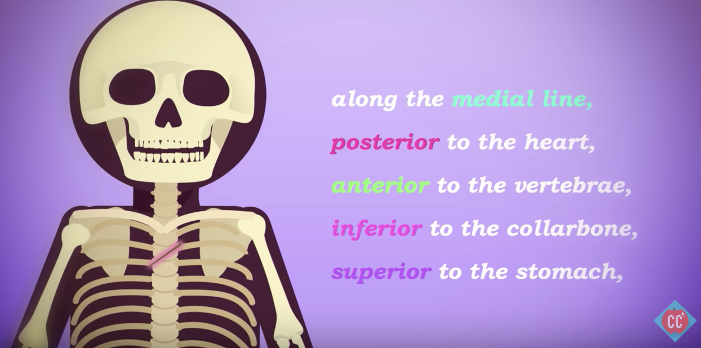

# Anatomy and Physiology

## 19-8-9 preview

## 19-8-9 Introduction to Anatomy & Physiology

12min视频，看了20min，因为有些单词要查，语速也比较快，整理花了40+min，加上走神的时间，花费70min。

感想：术语这东西真的没法避免吗？

- anatomy: 解剖学是有关身体结构的分解
- physiology: 生理学是有关身体部分如何协作运转
- 从微观到宏观，层级解构应该是：
    - atoms: 大概7*10^27个原子，这是个什么量级？
    - cellular: 红细胞大概5微米，腿部神经细胞有些可达1m长
    - tissues: 相似的细胞组成组织
    - organs: 不同组织相连协作组成器官
    - organ systems: 不同器官协作以完成某类型身体功能称为功能系统
    - the body: 各种系统协作运转，以完成人体功能
- homoeostatis: 动态平衡，看待身体运作的一个视角。存活在于平衡物质与能量，我们需要将食物、氧气、水转化成存活所需的稳定血压、细胞所需养料等等，当这种平衡被打破之后会生病，极限情况下会丧命，比如砍断一只胳膊，不及时止血会导致血压下降，血液没办法运送氧气养料给各个器官，于是它们就停摆了。
- 各种切面planes:
    - anatomical position: 解剖姿势，仰面朝上，手掌朝上放于身体两侧，腿部伸直，感谢您为科学作出的贡献。
    - sagittal(median) plane: （正中）矢状面，将身体从中间分为左右两部分。
    - para-sagittal plane: （侧）矢状面，平行于矢状面，但只在左侧或是右侧。
    - coronal(frontal) plane: 冠状面，将身体从中间分为腹背两部分。
    - transverse(horizontal) plane: 横断面，将身体从中间分为上下两部分。
- directional terms: 用以描述身体解构中的相对位置的标准术语
    - axial: 轴向的
    - appendicular: 四肢的
    - anterior/ventral: 前，例如眼睛
    - posterior/dorsal: 后，例如屁股
    - superior/cranial: 上/颅向
    - inferior/caudial: 下
    - medial: 内侧，靠近身体中轴线
    - lateral: 外侧
    - proximal: 四肢靠近中心称为近端
    - distal: 四肢远离中心称为远端

